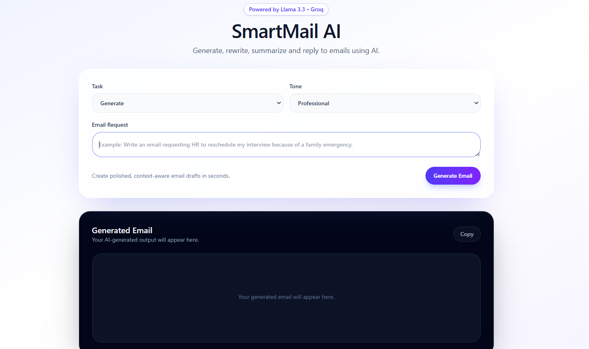
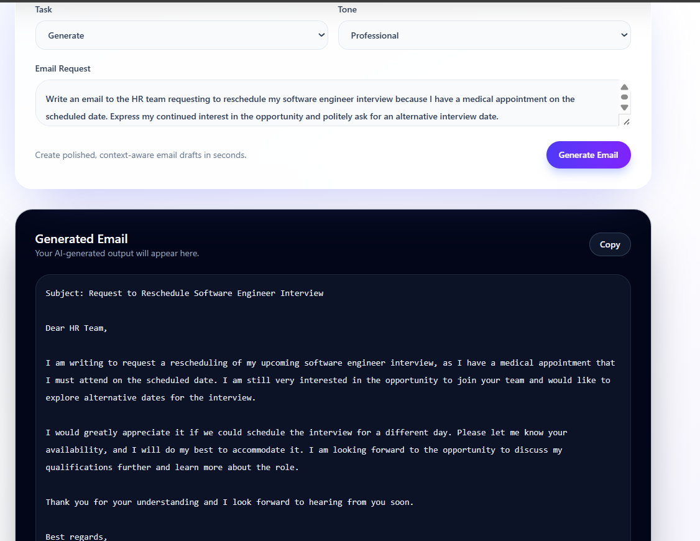
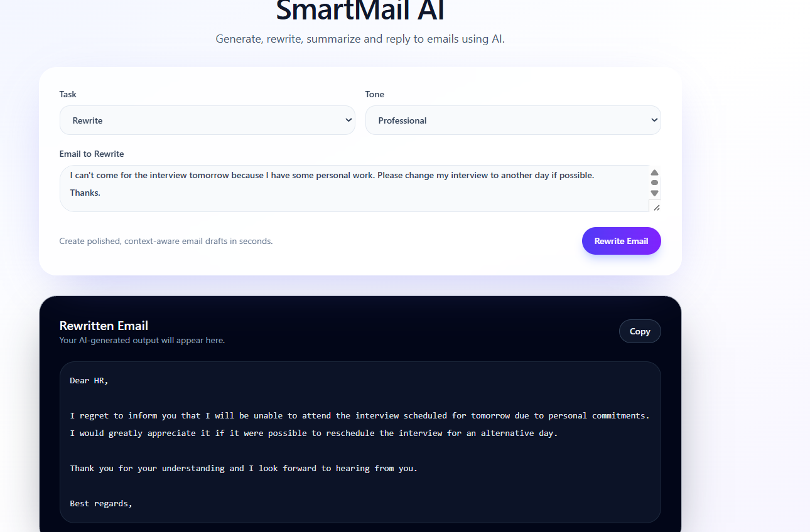
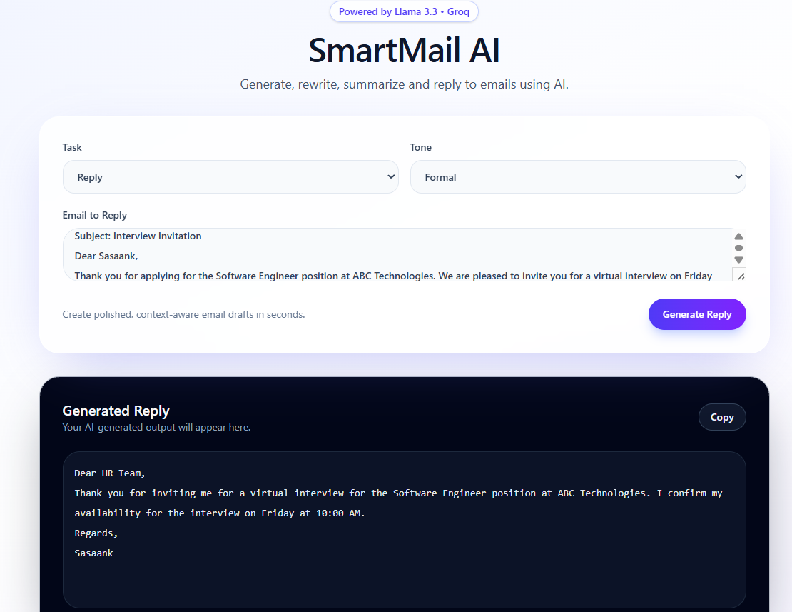
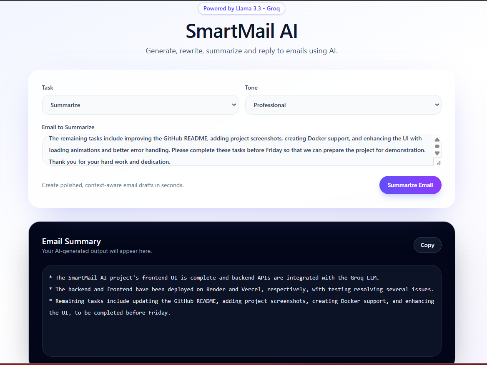

# 📧 SmartMail AI

<p align="center">
  <strong>LLM-Powered Email Assistant</strong><br>
  Generate • Rewrite • Summarize • Reply to emails using AI
</p>

<p align="center">


</p>

---

## 🌐 Live Demo

**Application**

https://smartmail-ai-rosy.vercel.app/

**Backend API**

https://smartmail-ai-7oeg.onrender.com

---

# 📖 Overview

SmartMail AI is a full-stack AI-powered email assistant that helps users create professional emails in seconds.

The application leverages the **Groq LLM API** to generate intelligent responses and provides four core capabilities:

- ✨ Generate new emails
- ✍ Rewrite existing emails
- 📨 Generate replies
- 📄 Summarize long emails

The project follows a modern client-server architecture using **React**, **TypeScript**, **Node.js**, and **Express**, communicating through REST APIs.

---

# ✨ Features

- AI-powered email generation
- Email rewriting with improved tone and grammar
- Smart reply generation
- Email summarization
- Multiple writing tones
- Clean responsive UI
- REST API architecture
- Copy generated output with one click
- Deployed using Vercel and Render

---

## 📸 Screenshots

| Home | Generate |
|------|----------|
|  |  |

| Rewrite | Reply |
|----------|-------|
|  |  |

| Summarize |
|------------|
|  |

---

# 🛠 Tech Stack

## Frontend

- React
- TypeScript
- Vite
- Axios
- CSS

## Backend

- Node.js
- Express.js
- REST APIs
- Groq SDK

## AI

- Groq API
- Llama 3.3 70B

## Deployment

- Vercel
- Render

## Tools

- Git
- GitHub
- VS Code
- Postman

---

# 📁 Project Structure

```
smartmail-ai
│
├── client
│   ├── public
│   ├── src
│   │   ├── App.tsx
│   │   ├── main.tsx
│   │   └── index.css
│   ├── package.json
│   └── vite.config.ts
│
├── server
│   ├── controllers
│   │   └── emailController.ts
│   ├── routes
│   │   └── emailRoutes.ts
│   ├── services
│   │   └── groqService.ts
│   ├── server.ts
│   └── package.json
│
├── assets
│
└── README.md
```

---

# ⚙ Installation

Clone the repository

```bash
git clone https://github.com/Sasaankk650/smartmail-ai.git
```

Move into the project

```bash
cd smartmail-ai
```

---

## Install Backend

```bash
cd server

npm install
```

---

## Install Frontend

```bash
cd ../client

npm install
```

---

# ▶ Running Locally

### Backend

```bash
cd server

npm run dev
```

Runs on

```
http://localhost:5000
```

---

### Frontend

```bash
cd client

npm run dev
```

Runs on

```
http://localhost:5173
```

---

# 🔑 Environment Variables

## Server (.env)

```env
GROQ_API_KEY=your_groq_api_key
PORT=5000
```

---

## Client (.env)

```env
VITE_API_URL=http://localhost:5000
```

For production:

```env
VITE_API_URL=https://smartmail-ai-7oeg.onrender.com
```

---

# 📡 API Endpoint

### POST

```
/api/email
```

### Request

```json
{
  "task": "Generate",
  "tone": "Professional",
  "text": "Write an email requesting interview rescheduling."
}
```

---

# 🚀 Deployment

### Frontend

- Vercel

### Backend

- Render

---

# 🔮 Future Improvements

- User Authentication
- Email Templates
- Conversation History
- Multiple AI Model Support
- Dark Mode
- Export as PDF
- Email Sending Integration

---

# 👨‍💻 Author

**Sasaank Kottakota**

GitHub

https://github.com/Sasaankk650

LinkedIn

www.linkedin.com/in/sasaank-kottakota-316b87247

---

## ⭐ If you found this project helpful, consider giving it a star.
